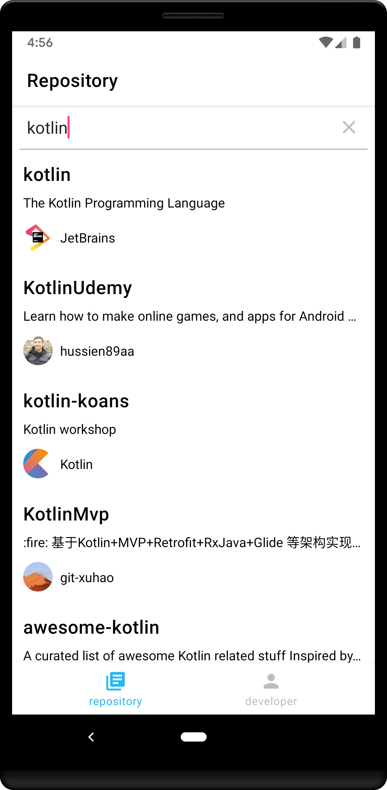
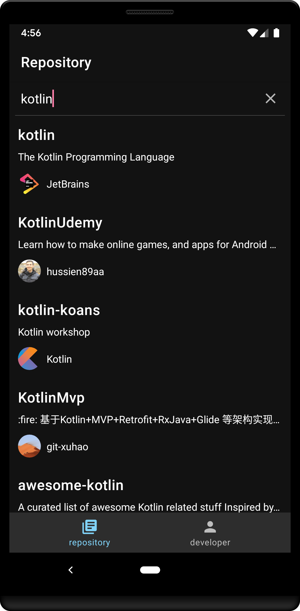
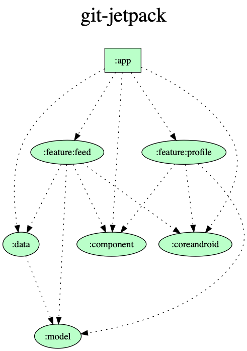

# git-jetpack
This is a sample app for browsing github using jetpack.

## QuickStart
Write the github access token in `local.properties`.

```
api_token=xxxxxxxxxxxx
```

## technology stack
- [Kotlin](https://github.com/JetBrains/kotlin)
- [Jetpack](https://developer.android.com/jetpack)
- Modularization
- SingleActivity
- [DarkTheme](https://developer.android.com/preview/features/darktheme)
- [MVVM](https://developer.android.com/jetpack/docs/guide)
- [Kotlin Coroutines](https://github.com/Kotlin/kotlinx.coroutines)
- [Lifecycle](https://developer.android.com/topic/libraries/architecture/lifecycle)
- [LiveData](https://developer.android.com/topic/libraries/architecture/livedata)
- [ViewModel](https://developer.android.com/topic/libraries/architecture/viewmodel)
- [DataBinding](https://developer.android.com/topic/libraries/data-binding)
- [Navigation](https://developer.android.com/topic/libraries/architecture/navigation.html)
- [MotionLayout](https://developer.android.com/reference/android/support/constraint/motion/MotionLayout)
- [KTX](https://developer.android.com/kotlin/ktx.html)
- [Dagger2](https://github.com/google/dagger)
- [Retrofit](https://github.com/square/retrofit)

## DarkTheme
| Day | Night |
----|---- 
|  |  |

## Modularization


- app
  - There are MainActivity class and Application class.
  - The app module injects dependencies into each module.
  - It holds AppComopnent and refers to Dagger's Module defined in each module.
- feature
  - It is a module for each feature.
  - There are Fragment, ViewModel and Adapter related to feature.
- component
  - There are custom views and resources.
  - BindingAdapter is also defined here.
- data
  - There are classes related to repository and api.
- model
  - There is business logic and Entity.
- coreandroid
  - There is a class used for each feature.
  - There are ViewModelFactory and Dagger's ViewModel scope.
  - If circular reference occurs in each feature module, place an interface in this module and inject dependencies from the app to solve it.

## TODO
- Linkage of Navigation and BottomNavigationView
  - Fragment is regenerated each time you switch items

## License
MIT License

Copyright (c) 2019 Keiju Matsumoto

Permission is hereby granted, free of charge, to any person obtaining a copy
of this software and associated documentation files (the "Software"), to deal
in the Software without restriction, including without limitation the rights
to use, copy, modify, merge, publish, distribute, sublicense, and/or sell
copies of the Software, and to permit persons to whom the Software is
furnished to do so, subject to the following conditions:

The above copyright notice and this permission notice shall be included in all
copies or substantial portions of the Software.

THE SOFTWARE IS PROVIDED "AS IS", WITHOUT WARRANTY OF ANY KIND, EXPRESS OR
IMPLIED, INCLUDING BUT NOT LIMITED TO THE WARRANTIES OF MERCHANTABILITY,
FITNESS FOR A PARTICULAR PURPOSE AND NONINFRINGEMENT. IN NO EVENT SHALL THE
AUTHORS OR COPYRIGHT HOLDERS BE LIABLE FOR ANY CLAIM, DAMAGES OR OTHER
LIABILITY, WHETHER IN AN ACTION OF CONTRACT, TORT OR OTHERWISE, ARISING FROM,
OUT OF OR IN CONNECTION WITH THE SOFTWARE OR THE USE OR OTHER DEALINGS IN THE
SOFTWARE.